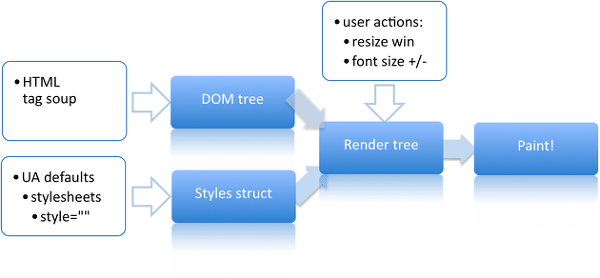
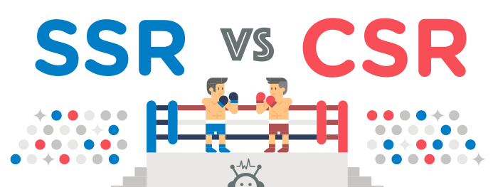

# CSR VS SSR

웹페이지에 접속해 Browser에서 우리가 보는 하나의 화면이 있다 가정합시다. 
이때 우리가 보는 이 화면을 어디에서 연산을 하는지 이것이 CSR 과 SSR 의 차이입니다.

## Rendering

CSR 과 SSR 에서 공통적으로 등장하는 R이라는 이니셜은 Rendering을 뜻하며,
 
이는 컴퓨터 프로그래밍 연산을 통하여 3차원 공간의 객체를 2차원 화면인 하나의 장멱 즉 Scene으로 바꾸어 표현하는 것을 뜻합니다.
 
이때 CSR 과 SSR 에서 말하는 Rendering 즉, Browser Rendering에 대해서 주요하게 살펴보겠습니다.

## Browser Rendering

Browser Rendering은 논리적인 문서의 표현식(HTML, MD)을 그래픽컬한 표현식으로 표현하는 작업입니다. 
해당 과정에서 중요한 것은 DOM element 와 style에 기반을 둔 레이아웃 계산 작업 입니다.  
웹 퍼블리셔 혹은 프론트엔드 개발자가 작성한 html 및 css를 레이아웃 계산식으로 변환  
계산된 element의 화면 표현 즉 계산한 것을 디스플레이로 표현하여 유저에게 보여주는 작업을 의미합니다.

## CSR VS SSR

이러한 렌더링 작업을 우리가 완벽하게 이해하지 못했지만 HTML을 작성하여 만들어진 DOM element 와 CSS style을 계산하여  
화면에 보여지는 일련의 과정이 Browser에서의 Rendering임을 알았습니다.
그럼 이번 주제인 CSR 과 SSR 의 차이는 무엇일까요 
가장 먼저 전통적인 파라다임인 SSR을 먼저 확인해봅시다. 

### SSR(Server Side Rendering)
 
SSR은 Server Side Rendering의 약자로 말그래도 서버측에서 랜더링을 맡아 진행하는 것을 의미합니다. 
이 경우 사용자가 웹페이지 접근 시 서버에서 페이지 요청을 하며 서버에서 Layout 및 Data Binding을 어느정도 구성 하여 사용자에게 반환하는 방식입니다. 
이때 API 호출, 데이터 바인딩 하는 것을 전부 서버에서 처리하여 담당하게 됩니다. 
SSR이라고 할지라도 Client 사이드에서 랜더링을 처리하는 경우도 있습니다.

### 장점
1. 초기 로딩 속도가 빠르다
2. 모든 검색 엔지에 대한 SEO(검색 엔진 최적화)가 가능하다
- 당연한 이치이지만 SSR의 경우 유저가 접속한 하나의 페이지에 해당하는 리소스 만을 받아오기 때문에 당연히 초기 로딩 속도가 빠릅니다.  
동적으로 HTML을 만드는 작업이 없고 완벽하게 만들어진 HTML을 받아와서 랜더링 하기 때문에 빈 HTML을 보내는 CSR과 반대로 검색엔진 최적화가 가능합니다.

### 단점
1. 사용자 UX
2. 트래픽, 서버 부하
3. 데이터 처리
- 매번 페이지를 요청할 때마다 새로고침이 되기 때문에 사용자 UX가 떨어지는 형태를 뛰며, 
또한 매번 서버에 요청하는 방식으로 인해 트래픽이 발생 이는 서버 부하까지 영향을 미칠 수 있습니다.  
또한 데이터를 처리하는 것 또한 서버를 거처야 하는 단점이 있습니다. 

### CSR(Client Side Rendering)
 
CSR은 Client Side Rendering의 약자로 서버에서는 리소스 만을 제공하고, Client에서 랜더링을 맡아서 진행하는 것을 뜻합니다. 
즉 사용자가 서버에 요청을 할때마다 리소스를 제공하고 Client 쪽에서 랜더링을 진행하여 사용자에게 반환을 하는 것입니다. 
최초에 한번 서버에서 전체 페이지를 로딩하여 보내주고 이후에는 요청이 올때 서버에서  리소스를 재공한 후 Client가 해석하고 랜더링하는 방식을 의미합니다.

### 장점
1. 뛰어난 사용자 UX
2. 서버 요청 최소화
- 최초에 HTML과 Static 파일들만 다운로드 받으면, 동적으로 빠르게 뷰를 구성할 수 있기 때문에 사용자 UX에 강점을 드러냅니다  
최초의 통신에서 모든 리소스를 받아오기 때문에 이는 서버 요청 감소에 영향을 미칩니다.

### 단점
1. 초기 로딩 속도가 느리다
2. SEO 문제
- 최초에 모든 리소스를 다 다운로드 받아야 하기 때문에 초기 로딩 속도가 SSR과 비교해서 느린 편입니다. 
또한 최초 통신에서 받아오는 것이 빈 HTML이기 때문에 이는 SEO(검색 엔진 최적화)에 문제를 발생시킵니다. 

## 결론
CSR이 좋다 SSR이 좋다로 결론이 나지 않습니다. 또한 이를 혼용한 웹페이지도 등장하기 때문에  
자신이 개발해야하는 웹 페이지의 특성에 따라서 파라다임을 결정해 만드는 것을 추천드립니다. 
