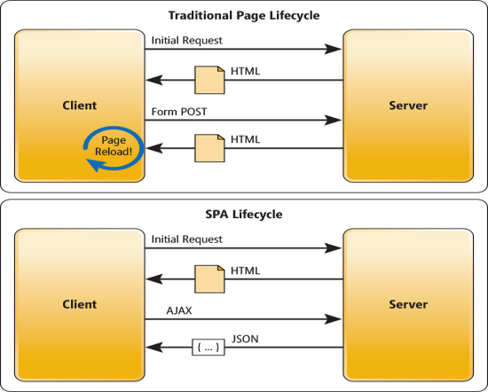

# SPA single page Application 

## SPA
 SPA  란 Single Page Application  의 약자로서 단일 페이지 어플리케이션입니다.  
현재 웹개발의 트렌드를 담당하고 있습니다.  
간단하게 설명을 하면 한개의 페이지를 가지는 어플리케이션이라고 생각하면 편합니다. 
기존 웹 서비스의 경우 홈 / 로그인 / 메뉴 별 페이지들을 다 각각 로드 하는 형식이라면 
SPA 의 경우 각 페이지들을 로드하는 것처럼 보이지만 실제로는 페이지는 동일하게 있고 내용만 바뀌는 형식입니다.

## MPA
SPA와 반대되는 말로 전통적인 페이지 라이프 사이클을 가지는 MPA  가 있습니다.  
MPA는 Multi Page Application  의 약자로서 다중 페이지 어플리케이션입니다. 

## Life Cycle

Traditional Page LifeCycle이 MPA입니다. 그림을 보면 사용자의 모든 요청에 HTML을 전송하는 방식이며 
페이지 리로드시 새로 HTML을 받는 형태를 뜁니다. 
SPA의 경우 초기 요청에만 HTML을 받고 추가적인 요청에는 AJAX(서버통신)을 통한 데이터(JSON) 업데이트가 이루어집니다.

## 장단점

### SPA
- 가장 큰 장점은 서버의 사용없이 개발을 진행 할 수 있다는 점입니다. 
현존하는 SPA 프레임워크 대다수가 Node를 기반으로 하고 있고  
해당 프레임워크가 서버 역활을 하기 때문에 개발 함에 있어서 서버를 따로 구축하지 않아도 된다는 점입니다. 
즉 API 서버는 필요로 할 수 있어도, 웹 배포를 위해 서버를 구축하지 않아도 됩니다. 
또한 로컬 데이터를 효과적으로 캐싱 할 수 있습니다. 당연한 말이지만 초기 요청 한번에 모드 리소스를 다운받기 때문에 효과적인 캐싱이 가능합니다.(물론 API 요청이 없다는 가정하에 입니다.)
- 단점으로는 초기 요청에 모든 리소스를 다운받아야 하기 때문에 초기 구동 속도가 느립니다. 또한 동적으로 DOM을 구성하기 때문에 이는 SEO(검색 엔진 최적화)에서 분리합니다. (이를 해결하기 위해 SSR 방식을 도입한 기법들이 등장했습니다.)

### MPA
- MPA의 가장 큰 장점은 SEO(검색 엔진 최적화)에 탁월하다는 점입니다. 
완성된 HTML을 응답으로 받기 때문에 웹 겁색 엔진(크롤러)이 크롤링 하기 적합한 형태라서 그렇습니다
- 단점으로는 새페이지로 이동할 때마다 HTML을 받고 다시 랜더링 해야한다는 단점이 있습니다. 또한 웹 페이지 개발과 서버 개발의 응집도가 높아집니다. 즉 개발 하는데 웹 개발이랑 서버 개발이랑 밀접하게 붙어있게 됩니다. 

## 결론
개발을 함에 있어서 회사 소개 페이지를 만든다라고 가정하면 SEO, 빠른 초기 구동 속도가 필요로 하기 때문에 MPA를 사용하는 경우가 많고,  
동적으로 웹이 변화를 해야하고 데이터 간의 인터랙션이 많은 경우는 SPA를 쓰는 경우가 많습니다.(일단 저는 그랬습니다.) 
결론은 프로젝트의 방향성이 해당 패러다임을 결정하는 것이고 절대 우위라는 것은 없습니다. 
알맞게 쓰는 것이 중요합니다.